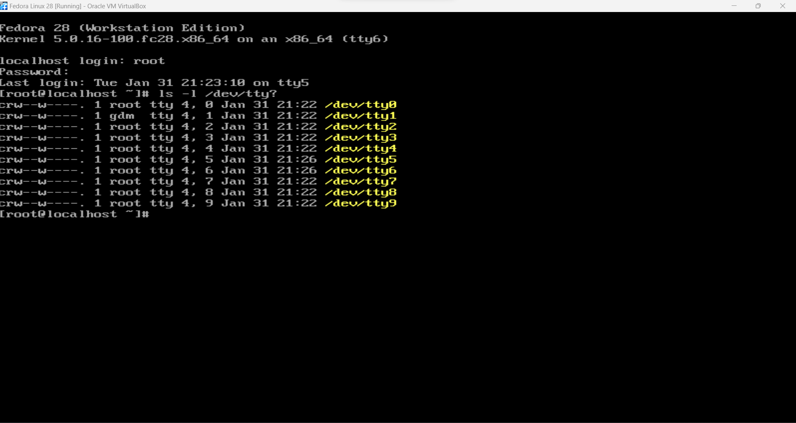
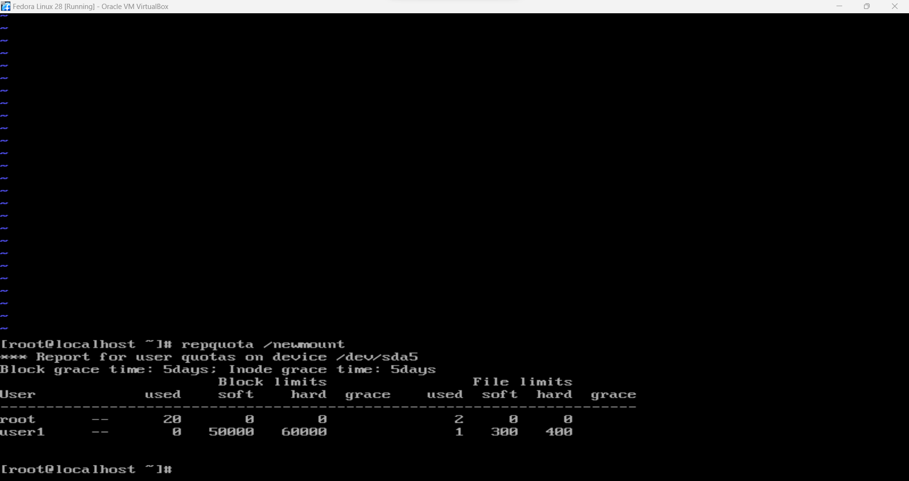

# CIT 352: Chapter 5

<!-- TODO -->
```
Micah Sudweeks
```

## Project 5-1

### Step 7

Insert the screen capture

<!-- TODO -->


## Project 5-2

### Step 9

Insert the screen capture

<!-- TODO -->


## Project 5-3

### Step 8

Insert the screen capture

<!-- TODO -->


### Step 14

Insert the screen capture

<!-- TODO -->


## Project 5-4

### Step 5

Insert the screen capture

<!-- TODO -->


### Step 13

Insert the screen capture

<!-- TODO -->


### Step 18

Insert the screen capture

<!-- TODO -->


## Project 5-5

### Step 6

Insert the screen capture

<!-- TODO -->


## Project 5-6

### Step 12

How many files and directories can user1 create on this partition?

<!-- TODO -->
```
around 700 files and directories.
```

How much space can user1 use in total on this partition?

<!-- TODO -->
```
User1 can use a total of 110000 GB of space, with a little bit of flexibility with that number
```

### Step 16

- How many files has user1 stored on this volume so far?

<!-- TODO -->
```
There's only one used file so far on user1.
```

- What is the full path of this file?

<!-- TODO -->
```
/root
```

- What is the total size of those files (in 1 KB blocks) and why?

<!-- TODO -->
```
The total size of those files are 1 KB, I think. I'm not actually too sure why.
```

Insert the screen capture

<!-- TODO -->


## Project 5-7

### Step 12

Insert the screen capture

<!-- TODO -->


## Command Reference

List all new commands you learned in this chapter.

<!-- TODO -->
```
your-command
your-command
your-command
```

## Discovery Exercises

Solve the following problems from the textbook under Discovery Exercises.
Search the internet for answers if you don't know.

### Exercise 2 

1. At the completion of the exercise, insert the screen capture of the output of lvdisplay command which shows that LV Size is about 5.7 GB 

 <!-- TODO -->

2. Skip (No need to do 2b)

Here are the steps to add 8 GB of storage space.


